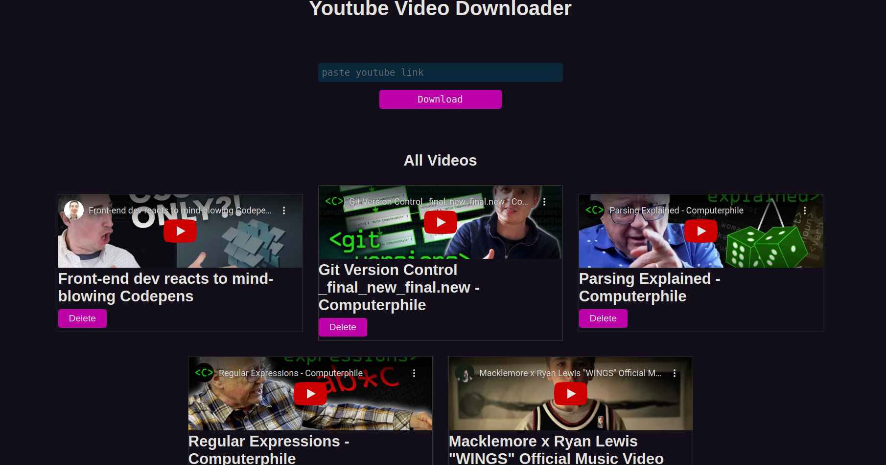

# Youtube-video-downloader

## Introduction

This is the final project after participating in the**Python and Javascript Mentorship program by Lux Academy and Data Science East Africa**. 
**Youtube-video-downloader** enables you download your favourite videos from youtube and save them to watch later. You only require to copy the 
the youtube link and hit the download.

## Technologies

1. [MongoDB](https://www.mongodb.com/).
2. [ExpressJS](https://expressjs.com/).
3. [ReactJS](https://reactjs.org/).
4. [NodeJS](https://nodejs.org/en/).
